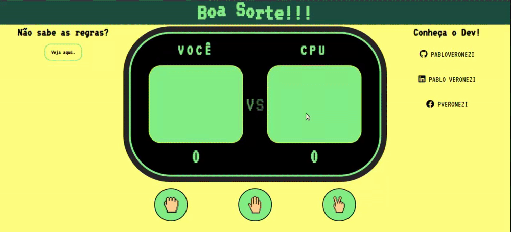

# Pedra, Papel e Tesoura
Você conhece pedra, papel, tesoura, certo?

Esse simples projeto foi feito para consolidar meus conhecimentos adquiridos com estudos na programação, utilizando HTML, CSS e JavaScript. A partir dessas ferramentas consegui desenvolver um dos jogos mais famosos da infância.

Gostaria de fazer um agradecimento a meu amigo e padrinho da programação <a href="https://github.com/GabrielSampaio7">Gabriel Sampaio</a>.
Sem seu support não teria conseguido terminar o projeto.

# O que ainda falta ser feito?!
- Responsividade
- Qualquer outra sugestão para melhorar ainda mais o projeto é sempre bem vinda.

# Boa sorte!!

